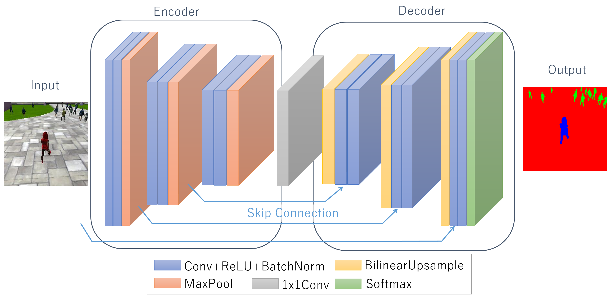

## Project: Deep Learning Follow Me

---


# Required Steps for a Passing Submission:
1. Setting up your local environment: This is how you will test your initial network design to make sure there are no errors. Otherwise, you can rack up charges on Amazon Web Services (AWS) with simple debugging instead of training. You will also use your local environment to evaluate your AWS trained model with the Follow Me simulator.
2. Setting up your AWS Amazon Machine Images (AMI).
3. Brief overview on how the simulator works and its basic controls.
4. Collecting data from the simulator to train your network.
5. Building your neural network.
6. Training your network and extracting your final model and weights from AWS.
7. Testing your model with the Follow Me simulator.
8. Getting your project ready for the final submission!

## [Rubric](https://review.udacity.com/#!/rubrics/1155/view) Points
### Here I will consider the rubric points individually and describe how I addressed each point in my implementation.  

---
### Writeup / README

#### 1. Provide a write-up / README document including all rubric items addressed in a clear and concise manner. The document can be submitted either in either Markdown or a PDF format.  

This is the Writeup for Deep Learning Follow Me Project.

This report should be written with a technical emphasis (i.e. concrete, supporting information and no 'hand-waiving'). Specifications are met if a reader would be able to replicate what you have done based on what was submitted in the report. This means all network architecture should be explained, parameters should be explicitly stated with factual justifications, and plots / graphs are used where possible to further enhance understanding. A discussion on potential improvements to the project submission should also be included for future enhancements to the network / parameters that could be used to increase accuracy, efficiency, etc. It is not required to make such enhancements, but these enhancements should be explicitly stated in its own section titled "Future Enhancements".

#### 2. The write-up conveys the an understanding of the network architecture.

##### The network architecture
I have applied Fully Convolutional Network (FCN) to tackle Follow Me project, which is to solve semantic segmentation problem, because FCN preserves the spatial information throughout the entire network while doing the convolution.

My FCN consists of following parts:
 - Encoder (Convolutional Neural Network)
 - Decoder (Transposed Convolutions)
 - 1x1 Convolution
 - Skip Connections

The overall network is shown below:


The encoder extracts features from the image. 1x1 convolution helped in reducing the dimensionality of the layer. After that, the decoder up-scales the output of the encoder. It results in segmentation of each individual pixels in the image. Some blocks are connected with each other. These skip connections allow the network to use information from multiple resolution scales. As a result, the network is able to make more precise segmentation decisions.

Snippet code of my FCN model is shown below: 
```python
def fcn_model(inputs, num_classes):
    
    # Encoder Blocks
    # With each encoder layer, the depth of model increases.
    enc1_layer = encoder_block(    inputs,  32, strides=1)
    enc2_layer = encoder_block(enc1_layer,  64, strides=1)
    enc3_layer = encoder_block(enc2_layer, 128, strides=1)
    
    # 1x1 Convolution layer
    conv1x1_layer = conv2d_batchnorm(enc3_layer, 40, kernel_size=1, strides=1)
    
    # Decoder Blocks
    dec1_layer = decoder_block(conv1x1_layer, enc2_layer, 128)
    dec2_layer = decoder_block(   dec1_layer, enc1_layer,  64)
    dec3_layer = decoder_block(   dec2_layer,     inputs,  32)
    x = dec3_layer
    
    return layers.Conv2D(num_classes, 1, activation='softmax', padding='same')(x)
```

Details of each components of the network is explained in following sections.


##### Encoder and 1x1 Convolution
Encoder consists of major three blocks. Each block includes two convolutional operations and one pooling operation.
The convolutional operation does convolution, ReLU activation and Batch Normalization via `separable_conv2d_batchnorm`. I chose max pooling to reduce dimension of layers. 
1x1 convolution helped in reducing the dimensionality of the layer.

Specification of operation of each layer is described below:

| layer_name | input           | kernel_size | strides | padding | output          |
| :--------: | --------------: | ----------: | ------: | :-----: | --------------: | 
| input      | 160 x 160 x   3 | ---         | ---     | ---     | ---             |
| conv1_1    | 160 x 160 x   3 | 3           | 1       | same    | 160 x 160 x  32 |
| conv1_2    | 160 x 160 x  32 | 3           | 1       | same    | 160 x 160 x  32 |
| maxpool1   | 160 x 160 x  32 | 2           | 2       | same    |  80 x  80 x  32 |
| conv2_1    |  80 x  80 x  32 | 3           | 1       | same    |  80 x  80 x  64 |
| conv2_2    |  80 x  80 x  64 | 3           | 1       | same    |  80 x  80 x  64 |
| maxpool2   |  80 x  80 x  64 | 2           | 2       | same    |  40 x  40 x  64 |
| conv3_1    |  40 x  40 x  64 | 3           | 1       | same    |  40 x  40 x 128 | 
| conv3_2    |  40 x  40 x 128 | 3           | 1       | same    |  40 x  40 x 128 |
| maxpool3   |  40 x  40 x 128 | 2           | 2       | same    |  20 x  20 x 128 |
| 1x1conv    |  20 x  20 x 128 | 1           | 1       | same    |  20 x  20 x  40 |

Actual python code of encoder is shown below:
```python
def encoder_block(input_layer, filters, strides):
    
    hidden_layer = separable_conv2d_batchnorm(input_layer,  filters, strides)
    hidden_layer = separable_conv2d_batchnorm(hidden_layer, filters, strides)
    output_layer = keras.layers.pooling.MaxPooling2D(pool_size=(2, 2), strides=None, padding='same', data_format=None)(hidden_layer)

    return output_layer
```

```python
def separable_conv2d_batchnorm(input_layer, filters, strides=1):
    output_layer = SeparableConv2DKeras(filters=filters,kernel_size=3, strides=strides,
                             padding='same', activation='relu')(input_layer)
    
    output_layer = layers.BatchNormalization()(output_layer) 
    return output_layer

def conv2d_batchnorm(input_layer, filters, kernel_size=3, strides=1):
    output_layer = layers.Conv2D(filters=filters, kernel_size=kernel_size, strides=strides, 
                      padding='same', activation='relu')(input_layer)
    
    output_layer = layers.BatchNormalization()(output_layer) 
    return output_layer
```

##### Decoder and Skip Connetions
Decoder help in upsampling the previous layer to a desired resolution or dimension.

| layer_name | input           | kernel_size | strides | padding | output          |
| :--------: | --------------: | ----------: | ------: | :-----: | --------------: | 
| upsample1  |  20 x  20 x  40 | 2           | 2       | same    |  40 x  40 x  40 |
| conv4_1    |  40 x  40 x  40 | 3           | 1       | same    |  40 x  40 x 128 |
| conv4_2    |  40 x  40 x 128 | 3           | 1       | same    |  40 x  40 x 128 |
| upsample2  |  40 x  40 x 128 | 2           | 2       | same    |  80 x  80 x 128 |
| conv5_1    |  80 x  80 x 128 | 3           | 1       | same    |  80 x  80 x  64 |
| conv5_2    |  80 x  80 x  64 | 3           | 1       | same    |  80 x  80 x  64 |
| upsample3  |  80 x  80 x  64 | 2           | 2       | same    | 160 x 160 x  64 |
| conv6_1    | 160 x 160 x  64 | 3           | 1       | same    | 160 x 160 x  32 |
| conv6_2    | 160 x 160 x  32 | 3           | 1       | same    | 160 x 160 x  32 |

skip connections allow the network to make more precise segmentation decisions. 

Snippet code of decoder block is shown below: 
```python
def decoder_block(small_ip_layer, large_ip_layer, filters):
    
    # Upsample the small input layer
    hidden_layer = bilinear_upsample(small_ip_layer)

    # Concatenate the upsampled and large input layers
    hidden_layer = layers.concatenate([hidden_layer, large_ip_layer])
    
    # Add some number of separable convolution layers
    hidden_layer = separable_conv2d_batchnorm(hidden_layer, filters)
    output_layer = separable_conv2d_batchnorm(hidden_layer, filters)
    
    return output_layer
```


#### 3. The write-up conveys the student's understanding of the parameters chosen for the the neural network.

There are many hyper parameters to tune performance of the network. I explain their parameters and why I selected the values. 

##### Learning Rate
In general, lower learning rate of training tends to get a better model faster at the end. Therefore, I tried various patterns of the value. As a result, I chose that `learning_rate = 0.002`.

##### Batch Size
Bigger value is preferable. My selected number is `batch_size = 32`.

##### Number of Epochs
`num_epochs = 40`

##### Steps per Epoch
`steps_per_epoch = 200`

##### Validation Steps
This parameter relates to number of images to validate. My setting is `validation_steps = 50`

##### Workers
`workers = 2`


#### 4. The student has a clear understanding and is able to identify the use of various techniques and concepts in network layers indicated by the write-up.

I have already explained the use of vairous techniques like 1x1 convolutions and fully connected layer. Please see above explanations.

#### 5. The student has a clear understanding of image manipulation in the context of the project indicated by the write-up.
*
The student is able to identify the use of various reasons for encoding / decoding images, when it should be used, why it is useful, and any problems that may arise.

#### 6. The student displays a solid understanding of the limitations to the neural network with the given data chosen for various follow-me scenarios which are conveyed in the write-up.

The student is able to clearly articulate whether this model and data would work well for following another object (dog, cat, car, etc.) instead of a human and if not, what changes would be required.


### Model
#### 1. The model is submitted in the correct format.

The file can be found in data/weights directory, which is the correct format (.h5) and runs without errors.

#### 2. The neural network must achieve a minimum level of accuracy for the network implemented.

The Intersection over Union (IoU) score is 44%. The network obtain an accuracy greather than the threshold (40%).


### Future Enhancements


#### Better score measures when the target from far away


A pooling layer is generally used to ...

Decrease the size of the output
Prevent overfitting


#### Better regularizer
According to the class contents, pooling layers have fallen out of favor recently. Some reasons are:

Recent datasets are so big and complex we're more concerned about underfitting.
Dropout is a much better regularizer.
Pooling results in a loss of information. Think about the max pooling operation as an example. We only keep the largest of n numbers, thereby disregarding n-1 numbers completely.

any people dislike the pooling operation and think that we can get away without it. For example, Striving for Simplicity: The All Convolutional Net proposes to discard the pooling layer in favor of architecture that only consists of repeated CONV layers. To reduce the size of the representation they suggest using larger stride in CONV layer once in a while

#### More features
spatial information
1x1 convolution depth might remove spatial information

#### More deep network 
The encoding stage exsists to extract features that will be useful for segmentation from the specific image. It does this via multiple layers that start by finding simple patterns in the first layer, and then gradually learns to understand more and more complex shapes/structures/feautures in each image the deeper the network goes. This is why I chose to do a 5 layer network; to allow it to increase the features it can find when presented with the training data.

#### More data


In this exercise 1, I have applied various filters to simulated point cloud data, and performed RANSAC segmentation to isolate objects in the scene.
The simulated tabletop scene is shown below.


The first filter I have applied is Voxel Grid Filter, which downsample input poind cloud data by taking a spatial average of the points confined by each voxel. I adjust the sampling size for a good job of representing the input point cloud as a whole by setting the voxel size along each dimension, LEAF_SIZE. Actual code and result image are shown below:

```python
### Voxel Grid filter
vox = cloud.make_voxel_grid_filter()
LEAF_SIZE = 0.01
vox.set_leaf_size(LEAF_SIZE, LEAF_SIZE, LEAF_SIZE)
cloud_filtered = vox.filter()
```


The second filter is Pass Through Filter, which remove useless data from input point cloud. I crop region of interest by specifying an axis with cut-off values along that axis because I have prior information about the location. Actual code and result image are shown below:

```python
### PassThrough filter
passthrough = cloud_filtered.make_passthrough_filter()
filter_axis = 'z'
passthrough.set_filter_field_name (filter_axis)
axis_min = 0.6
axis_max = 1.1
passthrough.set_filter_limits (axis_min, axis_max)
cloud_filtered = passthrough.filter()
```


After some filtering technique, I use RANSAC plane segmentation to remove the table itself from the scene. In this case, the model used is plane because I know the table can be expressed as plane shape. After that, I extract outlier points as objects because inlier points should be the table by applying this technique. Actual code and result images are shown below:
```python
### RANSAC plane segmentation
seg = cloud_filtered.make_segmenter()
seg.set_model_type(pcl.SACMODEL_PLANE)
seg.set_method_type(pcl.SAC_RANSAC)
# Max distance for a point to be considered fitting the model
max_distance = 0.01
seg.set_distance_threshold(max_distance)
inliers, coefficients = seg.segment()
extracted_inliers = cloud_filtered.extract(inliers, negative=False)
extracted_outliers = cloud_filtered.extract(inliers, negative=True)

### Save pcd for tabletop objects
pcl.save(extracted_inliers, 'table.pcd')
pcl.save(extracted_outliers, 'objects.pcd')
```


#### 2. Complete Exercise 2 steps: Pipeline including clustering for segmentation implemented.  

In this execise 2, I have built my perception pipeline in ROS, and added steps for cluster segmentation.

First of all, I created a ROS node that subscribes to point cloud topic, and publishes perception results like below. 
```python
if __name__ == '__main__':

    # ROS node initialization
    rospy.init_node('clustering', anonymous=True)

    # Create Subscribers
    pcl_sub = rospy.Subscriber("/sensor_stick/point_cloud", pc2.PointCloud2, pcl_callback, queue_size=1)

    # Create Publishers
    pcl_objects_pub = rospy.Publisher("/pcl_objects", PointCloud2, queue_size=1)
    pcl_table_pub   = rospy.Publisher("/pcl_table",   PointCloud2, queue_size=1)
    pcl_cluster_pub = rospy.Publisher("/pcl_cluster", PointCloud2, queue_size=1)

    # Initialize color_list
    get_color_list.color_list = []

    # Spin while node is not shutdown
    while not rospy.is_shutdown():
        rospy.spin()
```

In the callback function, `pcl_callback()`, I added the codes for exercise 1 and clustering codes. I used Euclidean Clustering algorithm to segment the points into individual objects. Actual code and result image are shown below.

```python
# Euclidean Clustering
white_cloud = XYZRGB_to_XYZ(extracted_outliers)
tree = white_cloud.make_kdtree()
# Create a cluster extraction object
ec = white_cloud.make_EuclideanClusterExtraction()
# Set tolerances for distance threshold 
# as well as minimum and maximum cluster size (in points)
ec.set_ClusterTolerance(0.05)
ec.set_MinClusterSize(1)
ec.set_MaxClusterSize(5000)
# Search the k-d tree for clusters
ec.set_SearchMethod(tree)
# Extract indices for each of the discovered clusters
cluster_indices = ec.Extract()

# Create Cluster-Mask Point Cloud to visualize each cluster separately
#Assign a color corresponding to each segmented object in scene
cluster_color = get_color_list(len(cluster_indices))

color_cluster_point_list = []

for j, indices in enumerate(cluster_indices):
    for i, indice in enumerate(indices):
        color_cluster_point_list.append([white_cloud[indice][0],
                                        white_cloud[indice][1],
                                        white_cloud[indice][2],
                                            rgb_to_float(cluster_color[j])])

#Create new cloud containing all clusters, each with unique color
cluster_cloud = pcl.PointCloud_PointXYZRGB()
cluster_cloud.from_list(color_cluster_point_list)

# Convert PCL data to ROS messages
ros_cluster_cloud = pcl_to_ros(cluster_cloud)

# Publish ROS messages
pcl_cluster_pub.publish(ros_cluster_cloud)
```


#### 3. Complete Exercise 3 Steps.  Features extracted and SVM trained.  Object recognition implemented.

In excercise 3, goal is to train an SVM to recognize specific objects in the scene. I have accomplished this by extracting a training set of features and labels, then training my SVM classifier, and finally using the classifier to predict what objects are in my segmented point cloud.

I have updated `compute_color_histograms()` and `compute_normal_histograms()` functions in `features.py` to extract a training set of features and labels like below. 

```python
def compute_color_histograms(cloud, using_hsv=False):

    # Compute histograms for the clusters
    point_colors_list = []

    # Step through each point in the point cloud
    for point in pc2.read_points(cloud, skip_nans=True):
        rgb_list = float_to_rgb(point[3])
        if using_hsv:
            point_colors_list.append(rgb_to_hsv(rgb_list) * 255)
        else:
            point_colors_list.append(rgb_list)

    # Populate lists with color values
    channel_1_vals = []
    channel_2_vals = []
    channel_3_vals = []

    for color in point_colors_list:
        channel_1_vals.append(color[0])
        channel_2_vals.append(color[1])
        channel_3_vals.append(color[2])
    
    # Compute histograms
    nbins=32
    bins_range=(0, 256)
    ch1_hist = np.histogram(channel_1_vals, bins=nbins, range=bins_range)
    ch2_hist = np.histogram(channel_2_vals, bins=nbins, range=bins_range)
    ch3_hist = np.histogram(channel_3_vals, bins=nbins, range=bins_range)

    # Concatenate and normalize the histograms
    hist_features = np.concatenate((ch1_hist[0], ch2_hist[0], ch3_hist[0])).astype(np.float64)
    normed_features = hist_features / np.sum(hist_features)

    return normed_features 


def compute_normal_histograms(normal_cloud):
    norm_x_vals = []
    norm_y_vals = []
    norm_z_vals = []

    for norm_component in pc2.read_points(normal_cloud,
                                          field_names = ('normal_x', 'normal_y', 'normal_z'),
                                          skip_nans=True):
        norm_x_vals.append(norm_component[0])
        norm_y_vals.append(norm_component[1])
        norm_z_vals.append(norm_component[2])

    # Compute histograms of normal values (just like with color)
    nbins=32
    bins_range=(-1.0, 1.0)
    norm_x_hist = np.histogram(norm_x_vals, bins=nbins, range=bins_range)
    norm_y_hist = np.histogram(norm_y_vals, bins=nbins, range=bins_range)
    norm_z_hist = np.histogram(norm_z_vals, bins=nbins, range=bins_range)

    # Concatenate and normalize the histograms
    hist_features = np.concatenate((norm_x_hist[0], norm_y_hist[0], norm_z_hist[0])).astype(np.float64)
    normed_features = hist_features / np.sum(hist_features)

    return normed_features
```

After that, SVM has been trained using `train_svm.py`. My normalized confusion matrix is shown below.


Then, object recognition steps have been implemented in the `pcl_callback()` function like below.
```python
    # Classify the clusters! (loop through each detected cluster one at a time)
    detected_objects_labels = []
    detected_objects = []

    for index, pts_list in enumerate(cluster_indices):
        # Grab the points for the cluster
        pcl_cluster = extracted_outliers.extract(pts_list)

        # Compute the associated feature vector
        # convert the cluster from pcl to ROS using helper function
        ros_cluster = pcl_to_ros(pcl_cluster)
        
        # Extract histogram features
        chists = compute_color_histograms(ros_cluster, using_hsv=True)
        normals = get_normals(ros_cluster)
        nhists = compute_normal_histograms(normals)
        feature = np.concatenate((chists, nhists))

        # Make the prediction, retrieve the label for the result
        # and add it to detected_objects_labels list
        prediction = clf.predict(scaler.transform(feature.reshape(1,-1)))
        label = encoder.inverse_transform(prediction)[0]
        detected_objects_labels.append(label)

        # Publish a label into RViz
        label_pos = list(white_cloud[pts_list[0]])
        label_pos[2] += .4
        object_markers_pub.publish(make_label(label,label_pos, index))

        # Add the detected object to the list of detected objects.
        do = DetectedObject()
        do.label = label
        do.cloud = ros_cluster
        detected_objects.append(do)

    rospy.loginfo('Detected {} objects: {}'.format(len(detected_objects_labels), detected_objects_labels))

    # Publish the list of detected objects
    detected_objects_pub.publish(detected_objects)
```


### Pick and Place Setup

#### 1. For all three tabletop setups (`test*.world`), perform object recognition, then read in respective pick list (`pick_list_*.yaml`). Next construct the messages that would comprise a valid `PickPlace` request output them to `.yaml` format.

In this project, I have implemented a perception pipeline using my work from Exercises 1, 2 and 3 to identify target objects from a so-called “Pick-List” in a particular order, pick up those objects and place them in corresponding dropboxes using PR2.

#### Filtering
I have added Statistical Outlier Filter to remove noise from previous work because this new dataset contains noise. Other filters, table segmentation and clustering method is same as previous work except some parameters based on the new environment and tabletop setups.

#### Recognition
I have increased the number of training model generation to 200 for each object for a larger set of random orientations of objects, and tried SVM parameter modifications (kernel, regularization etc.). However, `linear` kernel eventually gets best results in actual world scenes. Although `rbf` model fits well with the training dataset, poor recognition results were achieved in actual scene. I think that it might be due to overfitting. Then, I have tried parameter tuning, however good results cannot be provided. The accuracy results of parameter tuning for the training dataset are shown below. Finally, I chose the last one, kernel=`linear` and C=1000.

```
0.249 (+/- 0.007) for {'kernel': 'rbf', 'C': 1, 'gamma': 0.1}
0.940 (+/- 0.006) for {'kernel': 'rbf', 'C': 1, 'gamma': 0.01}
0.923 (+/- 0.006) for {'kernel': 'rbf', 'C': 1, 'gamma': 0.001}
0.842 (+/- 0.010) for {'kernel': 'rbf', 'C': 1, 'gamma': 0.0001}
0.282 (+/- 0.009) for {'kernel': 'rbf', 'C': 10, 'gamma': 0.1}
0.947 (+/- 0.006) for {'kernel': 'rbf', 'C': 10, 'gamma': 0.01}
0.946 (+/- 0.007) for {'kernel': 'rbf', 'C': 10, 'gamma': 0.001}
0.916 (+/- 0.007) for {'kernel': 'rbf', 'C': 10, 'gamma': 0.0001}
0.282 (+/- 0.009) for {'kernel': 'rbf', 'C': 100, 'gamma': 0.1}
0.947 (+/- 0.006) for {'kernel': 'rbf', 'C': 100, 'gamma': 0.01}
0.945 (+/- 0.007) for {'kernel': 'rbf', 'C': 100, 'gamma': 0.001}
0.939 (+/- 0.006) for {'kernel': 'rbf', 'C': 100, 'gamma': 0.0001}
0.282 (+/- 0.009) for {'kernel': 'rbf', 'C': 1000, 'gamma': 0.1}
0.947 (+/- 0.006) for {'kernel': 'rbf', 'C': 1000, 'gamma': 0.01}
0.945 (+/- 0.007) for {'kernel': 'rbf', 'C': 1000, 'gamma': 0.001}
0.934 (+/- 0.006) for {'kernel': 'rbf', 'C': 1000, 'gamma': 0.0001}
0.932 (+/- 0.005) for {'kernel': 'linear', 'C': 1}
0.932 (+/- 0.005) for {'kernel': 'linear', 'C': 10}
0.932 (+/- 0.005) for {'kernel': 'linear', 'C': 100}
0.932 (+/- 0.005) for {'kernel': 'linear', 'C': 1000} *
```

In following, results in each world are shown.
#### Result in `test1.world`
100% (3/3) objects in `test1.world`


#### Result in `test2.world`
80% (4/5) objects in `test2.world`


#### Result in `test3.world`
75% (6/8) ~ 87.5% (7/8) objects in `test3.world`, which depends on point cloud pattern.


### Discussion
Although I have tried the optional challenge environment, it is incomplete now due to time limitation. I think there are some steps to complete the challenge. 
 1. Improve object recognition accuracy
     I changed some SVM parameters to improve the accuracy. However, I can tune more other parameters such as the number of bins of histgrams, increase of model generation.
 2. PR2 robot rotation to capture side tables for the collision map.
     I need to provide additional publisher for `pr2_world_joint` to rotate PR2 robot. And, I need to understand the behavior of other ROS nodes which class materials don't explain well.
 3. Remove plural tables from the scene
     The challenge environment provides objects on some tables with different heights. Therefore, I need to remove them by applying RANSAC model fitting a few times or applying Pass Through Filter with specific ranges.


