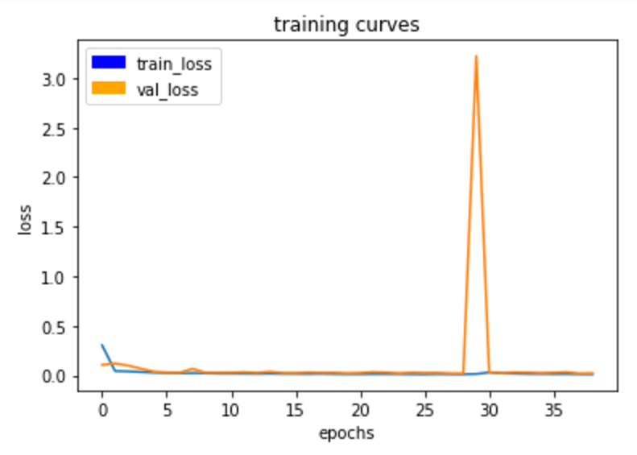
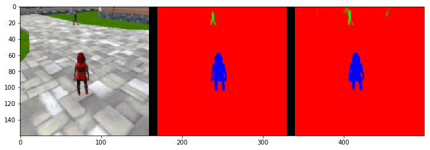
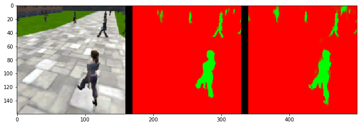
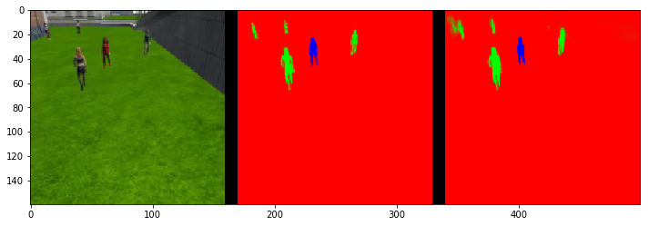
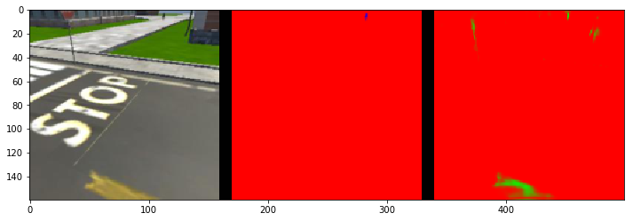

## Project: Deep Learning Follow Me

---


# Required Steps for a Passing Submission:
1. Setting up your local environment: This is how you will test your initial network design to make sure there are no errors. Otherwise, you can rack up charges on Amazon Web Services (AWS) with simple debugging instead of training. You will also use your local environment to evaluate your AWS trained model with the Follow Me simulator.
2. Setting up your AWS Amazon Machine Images (AMI).
3. Brief overview on how the simulator works and its basic controls.
4. Collecting data from the simulator to train your network.
5. Building your neural network.
6. Training your network and extracting your final model and weights from AWS.
7. Testing your model with the Follow Me simulator.
8. Getting your project ready for the final submission!

## [Rubric](https://review.udacity.com/#!/rubrics/1155/view) Points
### Here I will consider the rubric points individually and describe how I addressed each point in my implementation.  

---
### Writeup / README

#### 1. Provide a write-up / README document including all rubric items addressed in a clear and concise manner. The document can be submitted either in either Markdown or a PDF format.  

This is the Writeup for Deep Learning Follow Me Project.

#### 2. The write-up conveys the an understanding of the network architecture.

##### The network architecture
I have applied Fully Convolutional Network (FCN) to tackle Follow Me project, which is to solve semantic segmentation problem, because FCN preserves the spatial information throughout the entire network while doing the convolution.

My FCN consists of following parts:
 - Encoder (Convolutional Neural Network)
 - Decoder (Transposed Convolutions)
 - 1x1 Convolution
 - Skip Connections

The overall network is shown below:


The encoder extracts features from the image. 1x1 convolution helped in reducing the dimensionality of the layer. After that, the decoder up-scales the output of the encoder. It results in segmentation of each individual pixels in the image. Some blocks are connected with each other. These skip connections allow the network to use information from multiple resolution scales. As a result, the network is able to make more precise segmentation decisions.

Snippet code of my FCN model is shown below: 
```python
def fcn_model(inputs, num_classes):
    
    # Encoder Blocks
    # With each encoder layer, the depth of model increases.
    enc1_layer = encoder_block(    inputs,  32, strides=1)
    enc2_layer = encoder_block(enc1_layer,  64, strides=1)
    enc3_layer = encoder_block(enc2_layer, 128, strides=1)
    
    # 1x1 Convolution layer
    conv1x1_layer = conv2d_batchnorm(enc3_layer, 40, kernel_size=1, strides=1)
    
    # Decoder Blocks
    dec1_layer = decoder_block(conv1x1_layer, enc2_layer, 128)
    dec2_layer = decoder_block(   dec1_layer, enc1_layer,  64)
    dec3_layer = decoder_block(   dec2_layer,     inputs,  32)
    x = dec3_layer
    
    return layers.Conv2D(num_classes, 1, activation='softmax', padding='same')(x)
```

Details of each components of the network is explained in following sections.


##### Encoder and 1x1 Convolution
Encoder consists of major three blocks. Each block includes two convolutional operations and one pooling operation.
The convolutional operation does convolution, ReLU activation and Batch Normalization via `separable_conv2d_batchnorm`. I chose max pooling to reduce dimension of layers. 
1x1 convolution helped in reducing the dimensionality of the layer.

Specification of operation of each layer is described below:

| layer_name | input           | kernel_size | strides | padding | output          |
| :--------: | --------------: | ----------: | ------: | :-----: | --------------: | 
| input      | 160 x 160 x   3 | ---         | ---     | ---     | ---             |
| conv1_1    | 160 x 160 x   3 | 3           | 1       | same    | 160 x 160 x  32 |
| conv1_2    | 160 x 160 x  32 | 3           | 1       | same    | 160 x 160 x  32 |
| maxpool1   | 160 x 160 x  32 | 2           | 2       | same    |  80 x  80 x  32 |
| conv2_1    |  80 x  80 x  32 | 3           | 1       | same    |  80 x  80 x  64 |
| conv2_2    |  80 x  80 x  64 | 3           | 1       | same    |  80 x  80 x  64 |
| maxpool2   |  80 x  80 x  64 | 2           | 2       | same    |  40 x  40 x  64 |
| conv3_1    |  40 x  40 x  64 | 3           | 1       | same    |  40 x  40 x 128 | 
| conv3_2    |  40 x  40 x 128 | 3           | 1       | same    |  40 x  40 x 128 |
| maxpool3   |  40 x  40 x 128 | 2           | 2       | same    |  20 x  20 x 128 |
| 1x1conv    |  20 x  20 x 128 | 1           | 1       | same    |  20 x  20 x  40 |

Actual python code of encoder is shown below:
```python
def encoder_block(input_layer, filters, strides):
    
    hidden_layer = separable_conv2d_batchnorm(input_layer,  filters, strides)
    hidden_layer = separable_conv2d_batchnorm(hidden_layer, filters, strides)
    output_layer = keras.layers.pooling.MaxPooling2D(pool_size=(2, 2), strides=None, padding='same', data_format=None)(hidden_layer)

    return output_layer
```

```python
def separable_conv2d_batchnorm(input_layer, filters, strides=1):
    output_layer = SeparableConv2DKeras(filters=filters,kernel_size=3, strides=strides,
                             padding='same', activation='relu')(input_layer)
    
    output_layer = layers.BatchNormalization()(output_layer) 
    return output_layer

def conv2d_batchnorm(input_layer, filters, kernel_size=3, strides=1):
    output_layer = layers.Conv2D(filters=filters, kernel_size=kernel_size, strides=strides, 
                      padding='same', activation='relu')(input_layer)
    
    output_layer = layers.BatchNormalization()(output_layer) 
    return output_layer
```

##### Decoder and Skip Connetions
Decoder help in upsampling the previous layer to a desired resolution or dimension.

| layer_name | input           | kernel_size | strides | padding | output          |
| :--------: | --------------: | ----------: | ------: | :-----: | --------------: | 
| upsample1  |  20 x  20 x  40 | 2           | 2       | same    |  40 x  40 x  40 |
| conv4_1    |  40 x  40 x  40 | 3           | 1       | same    |  40 x  40 x 128 |
| conv4_2    |  40 x  40 x 128 | 3           | 1       | same    |  40 x  40 x 128 |
| upsample2  |  40 x  40 x 128 | 2           | 2       | same    |  80 x  80 x 128 |
| conv5_1    |  80 x  80 x 128 | 3           | 1       | same    |  80 x  80 x  64 |
| conv5_2    |  80 x  80 x  64 | 3           | 1       | same    |  80 x  80 x  64 |
| upsample3  |  80 x  80 x  64 | 2           | 2       | same    | 160 x 160 x  64 |
| conv6_1    | 160 x 160 x  64 | 3           | 1       | same    | 160 x 160 x  32 |
| conv6_2    | 160 x 160 x  32 | 3           | 1       | same    | 160 x 160 x  32 |

skip connections allow the network to make more precise segmentation decisions. 

Snippet code of decoder block is shown below: 
```python
def decoder_block(small_ip_layer, large_ip_layer, filters):
    
    # Upsample the small input layer
    hidden_layer = bilinear_upsample(small_ip_layer)

    # Concatenate the upsampled and large input layers
    hidden_layer = layers.concatenate([hidden_layer, large_ip_layer])
    
    # Add some number of separable convolution layers
    hidden_layer = separable_conv2d_batchnorm(hidden_layer, filters)
    output_layer = separable_conv2d_batchnorm(hidden_layer, filters)
    
    return output_layer
```


#### 3. The write-up conveys the student's understanding of the parameters chosen for the the neural network.

There are many hyper parameters to tune performance of the network. I explain their parameters and why I selected the values. And my training history is shown below:



In the middle of training, somehow there is a big peak of loss. Although I'm not sure what causes this, I guess that is due to dropping local minimum or computational error.

##### Batch Size
Batch is a subset of the dataset. Handling a subset of whole dataset is good way to train a model with when memory is not enough. But it is computationally inefficient. Therefore bigger value is preferable if the system is available. My selected number is `batch_size = 32`.

##### Learning Rate
In general, lower learning rate of training tends to get a better model faster at the end. But lower rate require more time. Therefore, I tried various patterns of the value. As a result, I chose that `learning_rate = 0.002`.

##### Number of Epochs
This parameter indicates a length of training process. This parameter should be determined with learning rate. I chose `num_epochs = 40` with the above learning rate.

##### Steps per Epoch
This value indicates the number of training images in an epoch. My setting is `steps_per_epoch = 200`.

##### Validation Steps
This parameter relates to number of images to validate. This value should be determined with the number of training image dataset. My setting is `validation_steps = 50`.

##### Workers
This is the number of processing thread. This should be decided by system power and performance. My setting is `workers = 2`.


#### 4. The student has a clear understanding and is able to identify the use of various techniques and concepts in network layers indicated by the write-up.

I have already explained the use of vairous techniques like 1x1 convolutions and fully connected layer. Please see above explanations.

#### 5. The student has a clear understanding of image manipulation in the context of the project indicated by the write-up.

I have already explained the use of vairous reasons for encoder and decoder and why they are used. Please see above explanations.

#### 6. The student displays a solid understanding of the limitations to the neural network with the given data chosen for various follow-me scenarios which are conveyed in the write-up.

In my network model, I can obtain the required score. But more data are needed for various follow-me scenario which is not provided by the project. Furthermore, if I would like the drone to follow another object like dog, cat and car, re-training for such objects will be required.

### Model
#### 1. The model is submitted in the correct format.

The file can be found in data/weights directory, which is the correct format (.h5) and runs without errors.

#### 2. The neural network must achieve a minimum level of accuracy for the network implemented.

The Intersection over Union (IoU) score is 44%. The network obtain an accuracy greather than the threshold (40%).

Some result image of predication are shown below:






Result image and video of QuadRotor Simulator are shown below:


### Future Enhancements

I think that there are several ways to improve segmentation accuracy. I list up them for future enhancements.

#### Analyze layer results when the target from far away
In the current network model, segmentation accuracy when the target from far away is worse than accuracy when near. Then it might be effective to analyze which layer mostly affects the detection of the far target.



#### More deep network 
To handle more complex shapes or structure, more deep network layer is needed. Therefore, more deep net might solve the far away target problem described above.

#### Better regularizer
In this project, I chose max pooling which is generally used to decrease the size of the output and prevent overfitting. According to the class contents, pooling layers have fallen out of favor recently due to some reasons. Therefore, other advanced techniques like dropout might improve the accuracy.

#### More spatial features
To achieve more accurate segmentation results, more precise spatial information should be needed. My 1x1 convolution whose depth is twenty might remove spatial information unnecessarily.

#### More data
As described above section, my network model can obtain the required score of 40%. But more data are needed for various follow-me scenario which is not provided by the project. 

